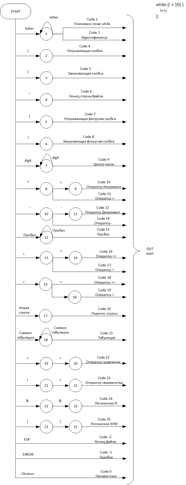

**Лабораторная работа 2. Разработка лексического анализатора (сканера)**

**Цель работы**
Изучить назначение и принципы работы лексического анализатора в структуре компилятора. 
Спроектировать алгоритм (диаграмму состояний) и выполнить программную реализацию сканера для выделения лексем из входного текста. 
Интегрировать разработанный модуль в ранее созданный графический интерфейс языкового процессора.

**Сведения об авторе.**
Студент: Кашин Андрей Вячеславович Группа: АВТ-314

**Постановка задачи.**
Разработать лексический анализатор (сканер) в соответствии с индивидуальным вариантом задания, интегрировать его в приложение из лабораторной работы №1 и обеспечить наглядный вывод результатов.

**Требования к реализации сканера:**

Разработать программный модуль лексического анализа, который:
-принимает на вход строку (исходный текст программы);
-выделяет все допустимые лексемы согласно варианту;
-классифицирует лексемы по типам (например: "ключевое слово", "идентификатор", "число", "оператор", "разделитель").
-любые символы, не соответствующие ни одному из допустимых типов лексем, считать недопустимыми и выводить сообщение об ошибке с указанием позиции.
-учитывает многострочность входного текста.

**Вариант задания:**
100. Цикл while на языке C

**Диаграмма состояний:**\


**Корректный пример:**
```
while (i < 10) {i++;};
```

| Код | Тип                  | Лексема | Позиция   |
|-----|----------------------|---------|-----------|
| 1   | Ключевое слово while | while   | 1:1-5     |
| 15  | Пробел               | ␣       | 1:6-6     |
| 4   | Разделитель (        | (       | 1:7-7     |
| 2   | Идентификатор        | i       | 1:8-8     |
| 15  | Пробел               | ␣       | 1:9-9     |
| 17  | Оператор <           | <       | 1:10-10   |
| 15  | Пробел               | ␣       | 1:11-11   |
| 9   | Целое число          | 10      | 1:12-13   |
| 5   | Разделитель )        | )       | 1:14-14   |
| 15  | Пробел               | ␣       | 1:15-15   |
| 7   | Разделитель {        | {       | 1:16-16   |
| 2   | Идентификатор        | i       | 1:17-17   |
| 10  | Оператор инкремента ++ | ++    | 1:18-19   |
| 6   | Разделитель ;        | ;       | 1:20-20   |
| 8   | Разделитель }        | }       | 1:21-21   |
| 6   | Разделитель ;        | ;       | 1:22-22   |


**Корректный пример многострочный:**
```
while (i < 10) {
    i++;
};
```

| Код | Тип                  | Лексема | Позиция   |
|-----|----------------------|---------|-----------|
| 1   | Ключевое слово while | while   | 1:1-5     |
| 15  | Пробел               | ␣       | 1:6-6     |
| 4   | Разделитель (        | (       | 1:7-7     |
| 2   | Идентификатор        | i       | 1:8-8     |
| 15  | Пробел               | ␣       | 1:9-9     |
| 17  | Оператор <           | <       | 1:10-10   |
| 15  | Пробел               | ␣       | 1:11-11   |
| 9   | Целое число          | 10      | 1:12-13   |
| 5   | Разделитель )        | )       | 1:14-14   |
| 15  | Пробел               | ␣       | 1:15-15   |
| 7   | Разделитель {        | {       | 1:16-16   |
| 20  | Перевод строки       | ¶       | 1:17-17   |
| 21  | Табуляция            | →       | 2:1-1     |
| 2   | Идентификатор        | i       | 2:2-2     |
| 10  | Оператор инкремента ++ | ++    | 2:3-4     |
| 6   | Разделитель ;        | ;       | 2:5-5     |
| 20  | Перевод строки       | ¶       | 2:6-6     |
| 8   | Разделитель }        | }       | 3:1-1     |
| 6   | Разделитель ;        | ;       | 3:2-2     |

**Некорректный пример:**
```
while (i ? 10) {
    i++;
};
```

| Код | Тип                  | Лексема | Позиция   |
|-----|----------------------|---------|-----------|
| 1   | Ключевое слово while | while   | 1:1-5     |
| 15  | Пробел               | ␣       | 1:6-6     |
| 4   | Разделитель (        | (       | 1:7-7     |
| 2   | Идентификатор        | i       | 1:8-8     |
| 15  | Пробел               | ␣       | 1:9-9     |
| -1  | Ошибка               | ?       | 1:10-10   |
| 15  | Пробел               | ␣       | 1:11-11   |
| 9   | Целое число          | 10      | 1:12-13   |
| 5   | Разделитель )        | )       | 1:14-14   |
| 15  | Пробел               | ␣       | 1:15-15   |
| 7   | Разделитель {        | {       | 1:16-16   |
| 20  | Перевод строки       | ¶       | 1:17-17   |
| 21  | Табуляция            | →       | 2:1-1     |
| 2   | Идентификатор        | i       | 2:2-2     |
| 10  | Оператор инкремента ++ | ++    | 2:3-4     |
| 6   | Разделитель ;        | ;       | 2:5-5     |
| 20  | Перевод строки       | ¶       | 2:6-6     |
| 8   | Разделитель }        | }       | 3:1-1     |
| 6   | Разделитель ;        | ;       | 3:2-2     |

